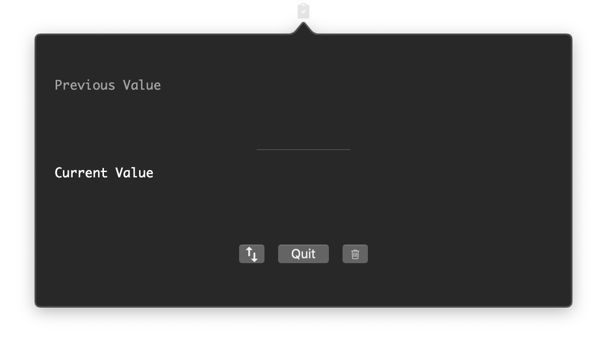

## From Larry Tesler to SourceNote to pbpaste to Clipbar

The recent death of [Larry Tesler](https://en.wikipedia.org/wiki/Larry_Tesler) made me realize how much we take for granted our modern tooling and led me into spending an unusual amount of time reading about the invention of the copy & paste as we know today _(even one of my favourite [talks](https://vimeo.com/36579366) mentions Larry and his principles)_

> ### Thank you for your amazing contributions Larry!

Upon my findings, I came across an incredible app called [SourceNote](https://www.sourcenoteapp.com/) and I was astonished by how much I could relate to the problem it aims to solve — _Feel free to stop reading this and watch their promo video, I thought it was such a simple elegant solution to a common occurrence in my workflow_

Anyways, that made me want to try and approach that same problem with my own tools just because native access to the system clipboard is built in on most operating systems and I was feeling empathetic towards Larry's terrific invention

## pbpaste

> _Note: pbpaste is a macOS command, if you're on linux [try this command](https://superuser.com/questions/288320/whats-like-osxs-pbcopy-for-linux) and if you are in Windows I think there is a clip command or you can try Cygwin with /dev/clipboard_

First thing that came to my mind was — "I can write a bash script to dump everything into a txt file and then use that file for searching later"

So what does that look like?

```bash
date && pbpaste && echo "" >> clipboard.txt
```

The date and the echo at the end is so you can facilitate some pattern for searching and browsing through the contents of the file as it grows indefinitely

Say you had **"Hello World"** in your clipboard, this is what you would get:

```
Thu 20 Feb 2020 20:20:20 EST
Hello World
 
```

You can alias that command to something more convenient and run it whenever you want to stash your clipboard data to this file

And now you can search through that file with something like grep _(or [ripgrep](https://github.com/BurntSushi/ripgrep), if you're like me)_

Nice! Except ...

## I'm not satisfied

Maybe that covers enough for some people, but I wasn't pleased with the solution, after using it for a bit I realized it just moved the problem to a different location

It solved having multiple "untitled" files open in my editor but it made a bit annoying to use and I noticed I kept going back to old habits

At this point my mind was thinking:

>_I like SourceNote but I don't want to reinvent it since it's already pretty solid, maybe I could just simplify my case if I looked for a pattern in my needs and solve for that instead_

## Less is more

The pattern I noticed was that I mostly cared about the previous occurrence of my clipboard and not necessarily the entire history

Countless time I thought I had the previous stuff in my clipboard only to see it was overwritten by some stuff later on

Another thing I wanted was a quick way of knowing what even is in my clipboard so I don't make the mistake of pasting the wrong thing _(like being sloppy and sending my password in a text message to a friend instead of some link)_

This would also avoid cluttering by keeping history of things that are no longer relevant indefinitely

I simply needed a short term stash for accessing the previous value kinda like how we need a temp variable to swap two values — although with [destructing](https://developer.mozilla.org/en-US/docs/Web/JavaScript/Reference/Operators/Destructuring_assignment) in ES6 you could just do

```js
[a, b] = [b, a] // swap A and B
```

Lastly, I wanted this to be minimal and automatic, I don't want to press another shortcut _(kudos to SourceNote for the idea to reuse ⌘+C, it is brilliant)_

## Clipbar

After a few introductory tutorials on Swift and learning how to build OSX apps, I decided a Menu Bar app would be perfect for this



It works by listening to the system's clipboard for changes and whenever there's a new entry it stashes the previous one

The UI displays a short preview of the current and previous values and gives you the option to swap them as well as clear the contents along with your clipboard value

There's definitely room for improvement _(feel free to contribute)_ and it might even be useless for most people but it was fun

Anyway, you can find the code for it on [GitHub](https://github.com/this-fifo/clipbar/) and you can [download](https://github.com/this-fifo/clipbar/releases) the release from there if you don't wish to build it from source. 😁
